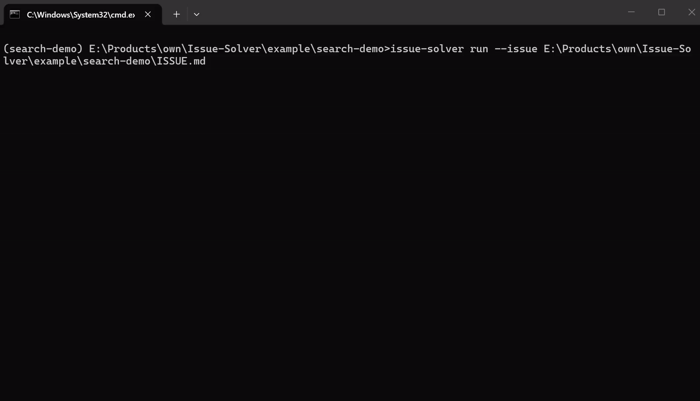
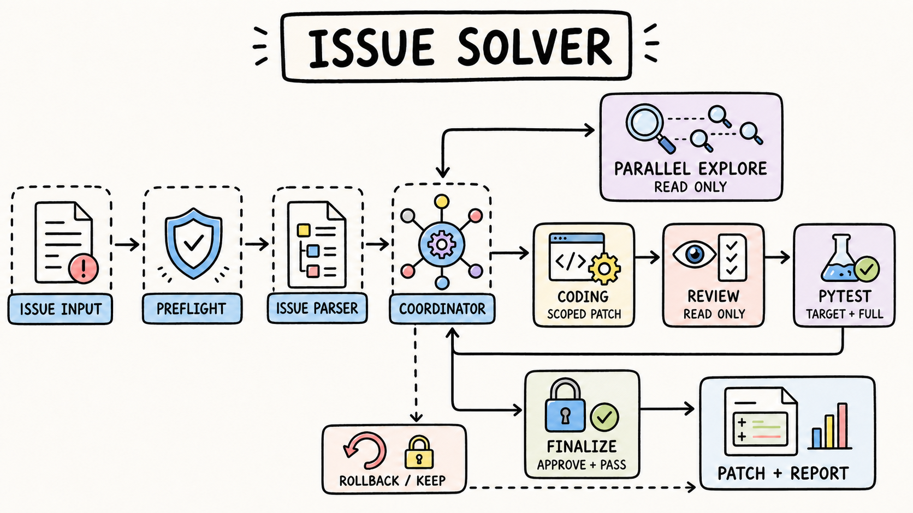

# Issue Solver

`Issue Solver` 是一个面向本地 Git 仓库的自动化 Issue 修复工作流。它使用 LangGraph 编排需求解析、并行代码探索、受限修改、独立 Review 和真实 pytest 验证，并将每次决策、测试和最终 Patch 保存为可审计产物。

> **当前定位：** 面向 Windows 开发环境，当前仅支持 Python + pytest，推荐用于中小型 Git 仓库。

[测评结果](#测评结果) · [工程亮点](#工程亮点) · [架构概览](#架构概览) · [快速开始](#快速开始) · [项目文档](#文档)

<p align="center">
  
</p>

## 测评结果

评测集选取 15 个真实开源项目的 GitHub Issue，包括 10 个普通案例和 5 个困难案例；系统对每个案例完成一次端到端运行。测评使用 `deepseek-v4-flash`，时间为 2026-07-21。

| Issue 数 | 成功修复 | 总成功率 | 普通成功率 | 困难成功率 | Patch 生成率 | 测试通过率 | 平均耗时 | 平均轮次 | 平均 Token | 总 Token |
|---------:|---------:|---------:|-----------:|-----------:|----------------:|-------------:|---------:|---------:|-----------:|---------:|
| 15 | 13 | 86.67% | 100.00% | 60.00% | 86.67% | 86.67% | 411.67 秒 | 1.33 | 1,576,349.93 | 23,645,249 |

测试通过率按全部 Issue 计算：只有定向测试和全量回归均通过才计为通过。普通案例成功率为 100.00%，困难案例成功率为 60.00%。完整口径、逐项数据和失败分析见[测评结果报告](evaluation/results.md)，评测基线与测试说明见[评测集](evaluation/benchmark.md)。

> 案例均来自真实 GitHub Issue。相关 Issue 当前可能已经修复、关闭、重新打开或发生变化；结果仅对应固定修复前基线和附带回归测试。

## 工程亮点

- **多 Agent 状态图**：Coordinator 负责路由，Explorer 并行只读调查，Coder 受限写入，Reviewer 独立审查。
- **最小写入权限**：Coder 没有 Shell 权限，只能在任务允许范围内提交 unified diff；程序再用 Git 实际 Diff 对账。
- **真实测试闭环**：测试始终使用目标仓库自己的虚拟环境；只有 Review 通过且真实 pytest 全绿才生成最终 Patch。
- **安全与可恢复**：路径、Git 基线、Patch、工作区和测试命令均经过确定性校验，失败时按策略保留现场或回滚。
- **完整证据链**：每轮探索、编码、Review、测试、失败信息和 Patch 哈希都有独立产物，可定位到具体阶段和调用。

## 架构概览

<p align="center">
  
</p>

核心原则是让 LLM 负责判断与生成结构化意图，让确定性程序负责权限、状态转移、文件写入、测试执行和最终准入。只读探索可以并行，所有工作区写入保持串行。

完整运行路径见[完整流程图](docs/workflow.md)，详细的节点职责、数据结构、安全边界和设计取舍见[项目架构说明](docs/project-overview.md)。

## 快速开始

### 1. 准备控制器

需要 Windows、Python 3.13+ 和 [uv](https://docs.astral.sh/uv/)。在项目根目录执行：

```powershell
uv sync
Copy-Item .env.example .env
uv run pytest -q
```

在 `.env` 中填写 OpenAI Chat Completions 兼容服务的 `API_KEY`、`BASE_URL` 和 `MODEL_NAME`。

### 2. 准备目标仓库

目标目录必须是已有提交且工作区干净的 Git 仓库。仓库根目录需要准备唯一的 `.venv`、`venv` 或 `.conda`，其中已安装目标项目、pytest 和全部测试依赖；环境目录还需要加入目标仓库的 `.gitignore`。

```powershell
git -C <target-repo> status --short
& <target-repo>\.venv\Scripts\python.exe -m pytest --version
```

第一条命令应无输出。工具不会创建虚拟环境、安装依赖、执行 tox、提交代码、推送分支或创建 Pull Request。

### 3. 运行修复

```powershell
python -m cli.main run --repo <target-repo> --issue <issue-url-or-text>
```

`--issue` 支持普通文本、GitHub Issue URL，以及绝对路径形式的 UTF-8 Markdown 或文本文件。

也可以安装全局可编辑命令：

```powershell
uv tool install --editable <issue-solver-path>
issue-solver run --issue <issue-url-or-text>
```

运行报告、日志和最终 Patch 默认保存在 `.issue-solver-runs/<repo>/<run-id>/`，不会写入目标仓库。

## 文档

- [项目架构与设计说明](docs/project-overview.md)
- [完整运行流程图](docs/workflow.md)
- [评测集与验收约定](evaluation/benchmark.md)
- [15 项测评结果报告](evaluation/results.md)
- [评测测试源码说明](evaluation/tests.md)
