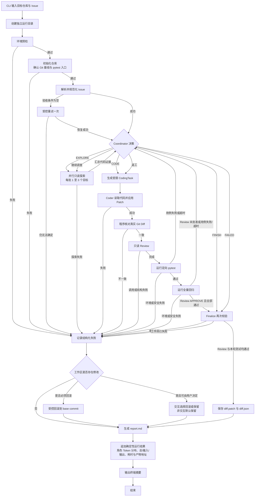

# Issue Solver 完整流程

下图覆盖从 CLI 输入、环境预检到最终 Patch、报告和失败处理的完整运行路径。

## 关键准入条件

- 首次 Coordinator 决策必须先探索仓库，不能直接修改代码。
- Explorer 和 Reviewer 的只读工具固定在当前仓库，Reviewer 的 `git_diff` 还固定相对基线 Commit；Coder 没有 Shell 权限，只能在 `allowed_scope` 内应用 Patch。
- Coding Agent 声明的修改文件必须与 Git 检测到的累计 Diff 完全一致。
- Test 节点先执行定向测试，只有通过后才执行全量回归；Review 为 `APPROVE` 且本轮测试全绿时直接进入 Finalize，其余结果返回 Coordinator 决定继续探索或返工。
- Finalize 只在 Review 为 `APPROVE` 且本轮所有测试为 `PASSED` 时保存最终 Patch，并再次执行相同准入校验。
- 成功运行保存最终 Patch；失败运行根据失败类型和工作区状态自动回滚、询问用户，或保留现场供开发者检查。
